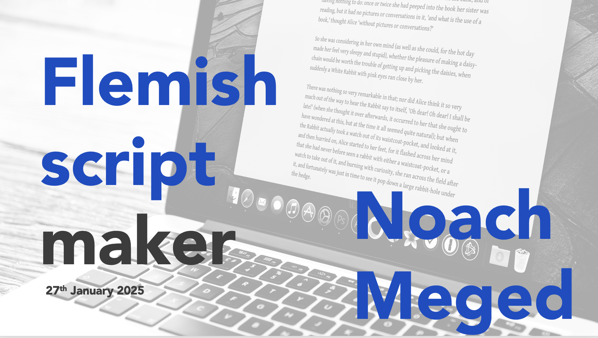

## → Flemish Recipe Translation

This tool automates the conversion of HelloFresh recipes from Dutch to Flemish while preserving formatting and content structure.

**Dutch2Flemish** is a lightweight and efficient tool that automatically converts Dutch text into natural **Flemish** variants. It addresses subtle yet important linguistic differences between the Netherlands and Flanders, ensuring content is both **locally accurate** and **contextually authentic**.

By preserving formatting, Dutch2Flemish saves hours of manual work and allows the **Flemish team** to focus on **proofreading**, **reducing errors** from the original Dutch or English source texts. This makes content **consistent, ready for upload, and perfectly tailored for Flemish-speaking users**.

## Workflow

---

### 1. Source Files
- Weekly recipe files in Dutch are exported from the internal system (`nl-NL_4_step.xlsx` and `nl-NL_6_step.xlsx`).  
- A **replacement sheet** (`Flemishreplacementsheet1.xlsx`) contains standardized Dutch → Flemish word mappings.

---

### 2. Flemish Translation (`Flemishmaker2_0.ipynb`)
- The user provides the path to the file to be translated.  
- The script:
  - Reads the recipe files while keeping only relevant columns.
  - Performs **case-insensitive replacements** based on the replacement sheet.
  - Applies **custom overrides** for common phrasing (e.g., "haal uit de pot" → "haal uit de pan").  
  - Handles conditional replacements, e.g., replacing "ketjap" with "ketjap of zoete sojasaus" if not listed in the ingredient list.
  - Capitalizes steps and ensures consistent formatting.
  - Merges 4-step and 6-step recipes into a single Flemish output file.

---

### 3. Interactive Editing (Optional)
- Users can search for specific words across step columns (e.g., "pot" and "pan") and edit cells interactively in Jupyter or Colab.  
- Changes are saved back to the merged Excel file if needed.

---

### 4. Transforming Data for HelloFresh CPS
- Recipes are reshaped into **long format** (one step per row) with step numbers, titles, and descriptions.  
- Filters are applied to:
  - Keep only recipes starting with codes `R`, `Q`, or `P`.
  - Remove recipes with only one step.
- HTML formatting is applied automatically:
  - Bullet points are wrapped in `<ul>` / `<li>` tags.
  - Tips and special phrases (`Tip:`, `Weetje:`, `Gezondheidstip:`) are formatted with `<strong>` for the prefix and `<em>` for the content.  
  - Blank lines are ignored to maintain proper formatting for CPS upload.

---

### 5. Output
- The final transformed file is saved as `nl-BE_4+6_step_transformed.xlsx` and is ready to **upload directly into the HelloFresh CPS recipe system**.  
- The workflow **saves significant manual effort** while ensuring accuracy, proper formatting, and consistency.

---

### Tools & Files
| Tool / File | Purpose |
|-------------|---------|
| `Flemishmaker2_0.ipynb` | Main Python script for automated Dutch → Flemish conversion |
| `Flemishreplacementsheet1.xlsx` | Contains word and phrase mappings for translation |
| `nl-BE_4+6_step_transformed.xlsx` | Final output file for CPS upload |

